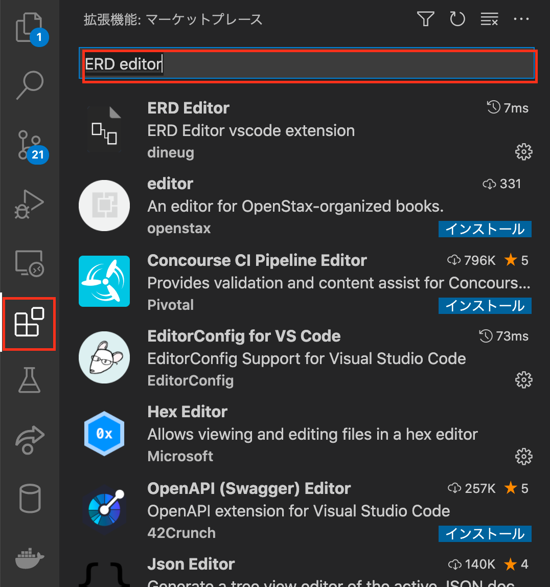
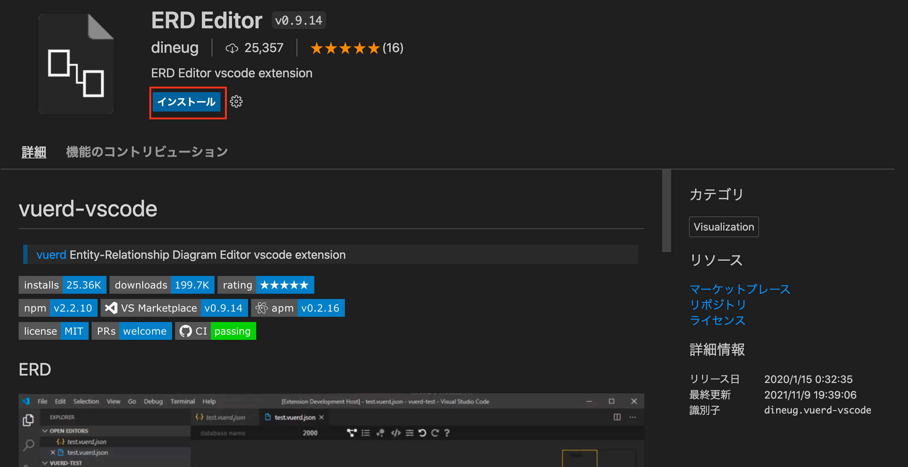
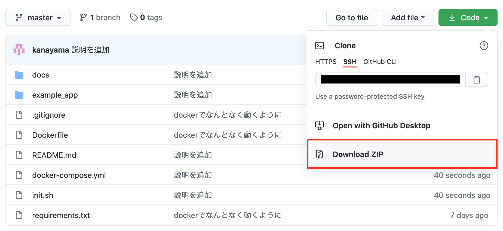
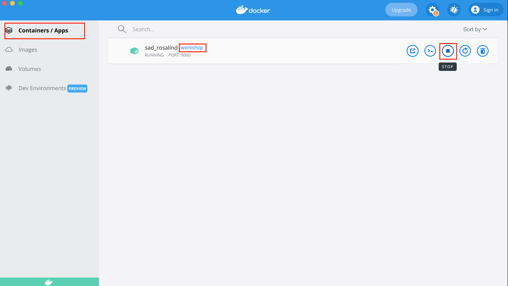

# README

## 事前準備

### インストールしておくもの

以下のリンクからそれぞれのインストールを行ってください。

- [Docker Desktop](https://www.docker.com/products/docker-desktop)
- [VSCode](https://azure.microsoft.com/ja-jp/products/visual-studio-code/)

### VSCodeの拡張機能の追加

インストールしたVSCodeを開き左側にある拡張機能から `ERD Editor` を検索します。

`ERD Editor` を選択し、インストールしてください。





### ワークショップで使用するコードのダウンロード

以下のいずれかの方法でこのリポジトリにあるコードをダウンロードしてください

- `git clone`
  - git操作ができる方はこちらで構いません
- zipでダウンロードする
  - git操作がわからない方は、以下の画像のようにZIPでダウンロードしてください。
  

### セットアップ

1. ダウンロードしたディレクトリをVSCodeで開いてください。

2. VSCodeのメニューから `ターミナル` → `新しいターミナル` を選択し、ターミナルを開いてください。

3. ターミナルで以下のコマンドを入力し、以下のファイルがあることを確認してください。
    - 以下があることを確認。（なかった場合VScodeで開くべきディレクトリが違います。）

      ```text
      Dockerfile
      README.md
      docs
      example_app
      init.sh
      requirements.txt
      ```

    - Windowsの場合

        ```bash
        dir
        ```

    - Macの場合

        ```bash
        ls
        ```

4. 以下のコマンドでdockerイメージのビルドを行ってください。

    ```bash
    docker build . -t workshop
    ```

5. 以下のコマンドでサーバを起動します。

    ```bash
    docker run -d --volume $(pwd)/:/code -p 8000:8000 workshop sh 'init.sh'
    ```

6. `http://localhost:8000/admin` にアクセスし、次のユーザでログインできることを確認できればセットアップ完了です。

    ```text
    Username: admin
    Password: admin
    ```

7. インストールしたDocker Desktopを起動し、左側の `Containers/Apps` を選択し画面中央に表示される `workshop` となっているコンテナを `stop` し停止してください。
    - **注意：追加・編集したデータは次回には消えるようになっています。**
    

8. 次回以降は、同様の画面から `start` を押すか、ターミナルで `docker run -d --volume $(pwd)/:/code -p 8000:8000 workshop sh 'init.sh'` を入力することで起動します。

9. セットアップ完了です！ワークショップ当日を楽しみにしてください。
