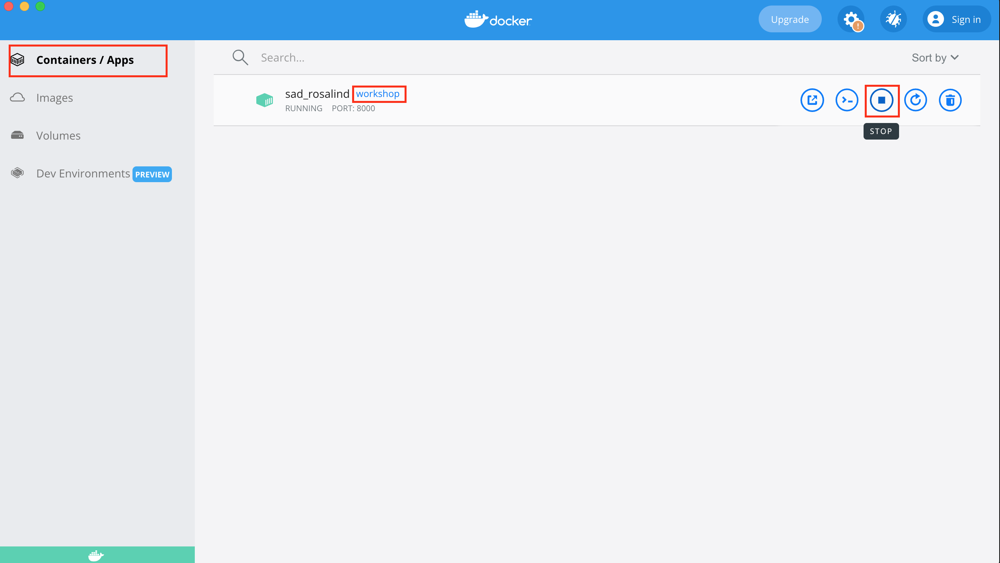
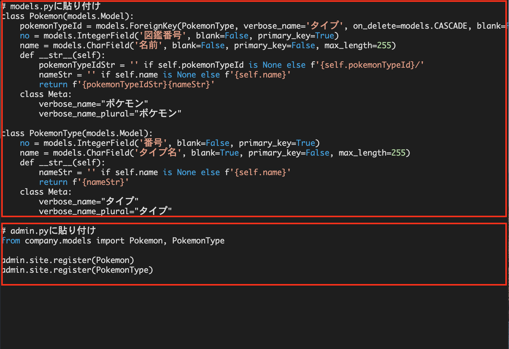

# 操作方法

## 前提条件

VSCode の拡張機能 [ERD Editor](https://marketplace.visualstudio.com/items?itemName=dineug.vuerd-vscode) をインストールしておいておくこと。

## 設計時の操作方法（ERD Editorの操作方法）

### ファイルを開く

`docs/model/model.vuerd` を開き以下のような画面になることを確認してください。

課題ではこのファイルを編集していくことになります。

別の画面になっている時は、画面上部の `Entity Relationship Diagram` のアイコンをクリックしてください。


### テーブルの追加

何もない部分を右クリックし `New Table` を選択してください。


- `table` にはそのテーブルの英語名
- `comment` にはそのテーブルの日本語名

を入力してください。

### カラムの追加

追加したテーブルの `+` ボタンを押すとカラムを追加できます。


- `column` は英語名
- `dataType` は 基本的に数値なら `INTEGER`、 文字なら `VARCHAR` （本ワークショップで対応しているのはこの二つのみです）
- `NULL` となっている部分は必ず入力が必要なら `N-N` (Non Null)、無くてもよいなら `NULL` （ダブルクリックで切り替わります。）
- `default` はなし（本ワークショップで対応していません）
- `comment` は日本語名

を入力・選択してください。

### カラムの削除

誤って追加してしまったカラムは、カラムにマウスを合わせると右側に `x` ボタンが表示されるので押すことで削除ができます。


### PKの設定

テーブルの中で一意に特定できるカラムのことを `Primary Key` と言います。

例えば生徒というテーブルがあったときに、同姓同名の生徒が何人かいる可能性があるので学生番号を付与することで個人を特定します。

設定したいカラムを右クリックし `Primary Key` を選んでください。

カラムの左側に鍵アイコンが出ていると設定されています。


### リレーションの設定

テーブルの関係を表すためにリレーションを使用します。

例えば社員を管理するテーブルに社員が所属している部門を表すカラムがあると部門名を変更する時にたくさんの社員の内容を変更しなければなりませんが、別途部門をテーブルで管理していると部門名の変更が楽になります。
そして部門に社員が属していることを表す関係をリレーションとして表します。

リレーションを設定するには、必ず２つのテーブルを用意した上で何もない部分を右クリックし以下のように `Relationship` の中から `Zero N` を選ぶようにしてください。（ワークショップではこれ以外動作するようにしていません。）


## 動かして確認する

### サーバが停止していることを確認する

Docker Desktopを起動し `workshop` が動いていないことを確認してください。

動いていれば以下の図のように `stop` ボタンを押し停止させてください。



### 設計内容からコードを作成する

`docs/model/model.vuerd` を開き 以下の画像のように画面上の `Generate Template` を押し、画面左に表示される。 `Workshop`を選択してください。

画面の右半分にコードが作成されます。


### 作成したコードを貼り付ける

上記で作成したコードのうち、

- 上の部分を `example_app/company/models.py`
- 下の部分を `example_app/company/admin.py`

に貼り付けます。

貼り付ける場所はコメントで指定されているより、下の部分に貼り付けてください。



### サーバを起動して確認する

ターミナルで以下のコマンドを発行すると変更した内容が反映されているので、内容確認してみてください。

```bash
docker run -d --volume $(pwd)/:/code -p 8000:8000 workshop sh 'init.sh'
```
